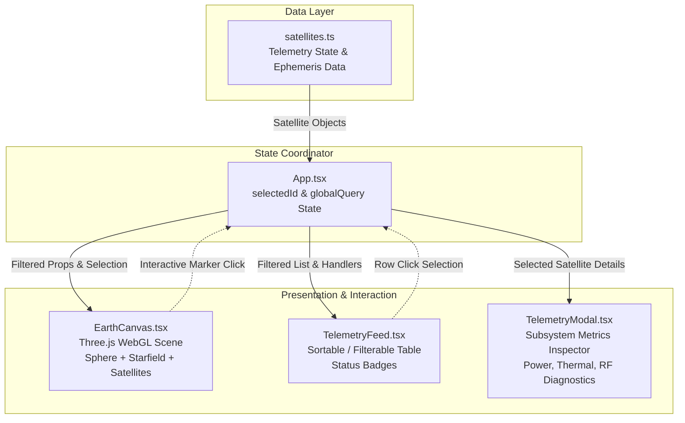

<div align="center">

# 🛰️ sat.observ

### Orbital Telemetry Console & Earth Observation Platform

An interactive, real-time 3D Earth observation and satellite constellation monitoring console built with **React 19**, **Three.js**, **TypeScript**, and **Vite**.

[](https://react.dev/)
[](https://www.typescriptlang.org/)
[](https://threejs.org/)
[](https://vite.dev/)
[](https://oxc.rs/)
[](https://www.netlify.com/)
[](LICENSE)
[](CONTRIBUTING.md)

[Live Features](#-key-features) • [Quick Start](#-getting-started) • [Architecture](#-architecture) • [Constellations](#-tracked-constellations) • [Deployment](#-deployment)

---

</div>

## 🔭 Overview

**`sat.observ`** is a high-performance aerospace telemetry console designed to visualize, track, and inspect orbital assets in real time. It combines an interactive WebGL-rendered 3D celestial sphere with synchronized telemetry feeds, providing flight dynamics controllers and space enthusiasts with instant situational awareness across Low Earth Orbit (LEO) and Medium Earth Orbit (MEO) constellations.

```
       .---.
      /     \     [STAR-1042] Alt: 550 km   | Vel: 7.59 km/s
     |   🌍  | --- [GPS-074]   Alt: 20180 km | Vel: 3.87 km/s
      \     /     [GAL-219]   Alt: 23222 km | Vel: 3.69 km/s
       '---'
```

---

## ✨ Key Features

- **🌍 Interactive 3D WebGL Earth Globe**
  - High-fidelity Three.js scene featuring realistic diffuse lighting, specular ocean reflections, wireframe topological overlay, and an atmospheric halo.
  - Spherical-to-Cartesian coordinate projection (`latLonToVec3`) mapping geographic coordinates directly to 3D world space.
  - Dynamic 600-point celestial starfield background.
  - Smooth intuitive orbit rotation controls (drag with pointer to adjust elevation and azimuth; automatic continuous planetary rotation when idle).

- **📡 Multi-Constellation Live Tracking**
  - Monitors global communication, navigation, and observation networks: **Starlink**, **OneWeb**, **GPS / Navstar**, **Galileo**, **Iridium**, and **GLONASS**.
  - Color-coded operational status markers:
    - 🟢 **Active** (`#4ade80`) — Normal orbital operations & high health index
    - 🟡 **Standby** (`#facc15`) — Idle, scheduled handoff, or orbital adjustment
    - 🔴 **Maintenance** (`#f87171`) — Diagnostic mode, low battery, or anomalous telemetry

- **⚡ Bi-Directional Interactive Sync**
  - Selecting any satellite in the telemetry list or on the globe locks camera attention and triggers a real-time animated pulsing targeting halo over the spacecraft.
  - Synchronized state between orbital coordinates, table records, and modal inspectors.

- **🔎 Dual-Tier Instant Filtering & Search**
  - **Global Command Search**: Query across satellite IDs, constellations, and operational statuses from the main navigation bar.
  - **Table-Level Filter**: Rapidly filter active table rows with instant sub-millisecond response.

- **📊 Comprehensive Subsystem Diagnostic Inspector**
  - Deep telemetry modal inspecting mission-critical vitals:
    - **Spatial**: Latitude (°), Longitude (°), Altitude (km), Orbital Velocity (km/s)
    - **Power & Thermal**: Battery state of charge (%), Subsystem temperature (°C)
    - **Comms & Telemetry**: RF Signal Strength (dBm), Timestamped UTC contact verification

- **🚀 Ultra-Fast Modern Engineering**
  - Built with **React 19** and **TypeScript** with strict type safety.
  - Powered by **Vite 8** for rapid Hot Module Replacement (HMR) and optimized production bundles.
  - Linted using **Oxlint** for blazing-fast code quality assurance.

---

## 🏗️ Architecture



---

## 🛰️ Tracked Constellations

| Constellation | Orbit Class | Typical Altitude | Orbital Velocity | Primary Function |
| :--- | :---: | :---: | :---: | :--- |
| **Starlink** | LEO | ~550 km | ~7.59 km/s | Global broadband internet |
| **OneWeb** | LEO | ~1,200 km | ~7.31 km/s | Global enterprise communications |
| **Iridium Next** | LEO | ~780 km | ~7.46 km/s | Global voice & narrowband M2M data |
| **GPS (Navstar)** | MEO | ~20,180 km | ~3.87 km/s | Global Positioning System (PNT) |
| **GLONASS** | MEO | ~19,100 km | ~3.95 km/s | Russian GNSS navigation network |
| **Galileo** | MEO | ~23,220 km | ~3.69 km/s | European civil global navigation |

---

## 📁 Project Structure

```text
sat.observ/
├── .bolt/                  # Bolt workspace and environment presets
├── public/                 # Static web assets
│   ├── favicon.svg         # SVG vector favicon
│   └── icons.svg           # Vector icon definitions
├── src/
│   ├── assets/             # Brand graphics and icons
│   │   ├── hero.png        # Console preview asset
│   │   ├── react.svg
│   │   └── vite.svg
│   ├── components/         # Modular telemetry and analytics components
│   │   ├── DataFeed.tsx
│   │   ├── EarthVisualization.tsx
│   │   ├── Header.tsx
│   │   ├── ImpactMetrics.tsx
│   │   └── ProcessingPipeline.tsx
│   ├── App.css             # High-tech dark aerospace styling & animations
│   ├── App.tsx             # Main dashboard shell & state coordinator
│   ├── EarthCanvas.tsx     # Three.js 3D Earth, orbit controls & raycasting
│   ├── TelemetryFeed.tsx   # Live satellite telemetry list & search filters
│   ├── TelemetryModal.tsx  # Deep diagnostic subsystem modal
│   ├── satellites.ts       # Satellite data models, types, and mock catalog
│   ├── index.css           # Global reset and typography setup
│   └── main.tsx            # React 19 application root
├── .env.example            # Environment variables template (Supabase ready)
├── .gitignore              # Git ignore rules
├── .oxlintrc.json          # Oxlint configuration
├── eslint.config.js        # ESLint flat configuration
├── index.html              # HTML5 entry point
├── netlify.toml            # Netlify build, routing, and security headers configuration
├── package.json            # Dependencies and npm script targets
├── tsconfig.json           # Root TypeScript configuration
├── tsconfig.app.json       # Application TypeScript compilation rules
├── tsconfig.node.json      # Vite tooling TypeScript configuration
└── vite.config.ts          # Vite build pipeline and plugin setup
```

---

## 🚦 Getting Started

### Prerequisites

- **Node.js**: `v18.0.0` or later (LTS recommended)
- **npm**: `v9.0.0` or higher (or `pnpm` / `yarn`)

### Installation

1. **Clone the repository**:
   ```bash
   git clone https://github.com/kit29-25bad095/sat.observ.git
   cd sat.observ
   ```

2. **Install dependencies**:
   ```bash
   npm install
   ```

3. **Configure environment variables (Optional)**:
   ```bash
   cp .env.example .env
   ```
   *(Populate `VITE_SUPABASE_URL` and `VITE_SUPABASE_ANON_KEY` if connecting to a live Supabase backend).*

4. **Start the local development server**:
   ```bash
   npm run dev
   ```
   Open [http://localhost:5173](http://localhost:5173) in your browser to explore the console.

---

## 🛠️ Available Scripts

| Command | Description |
| :--- | :--- |
| `npm run dev` | Launches the local Vite development server with instantaneous HMR. |
| `npm run build` | Compiles TypeScript (`tsc -b`) and bundles production assets into `dist/`. |
| `npm run preview` | Locally serves the optimized production build from `dist/` for validation. |
| `npm run lint` | Runs **Oxlint** for lightning-fast linting and code quality verification. |

---

## 🌐 Deployment

### Deploy to Netlify

The repository includes a ready-to-use [`netlify.toml`](./netlify.toml) pre-configured with:
- Automated build trigger (`npm run build`)
- Publish directory (`dist`)
- Single Page Application (SPA) redirects (`/* -> /index.html 200`)
- Immutable caching rules for static assets (`/assets/*`)
- Security response headers (`X-Frame-Options`, `X-Content-Type-Options`, `X-XSS-Protection`)

Deploy in one click or link your GitHub repository to [Netlify](https://app.netlify.com/):

```bash
# Deploy using Netlify CLI
npm install -g netlify-cli
netlify deploy --build --prod
```

### Deploy to Vercel

```bash
npx vercel
```

---

## 🗺️ Roadmap

- [ ] **Live TLE Integration**: Ingest real-time Two-Line Element (TLE) ephemeris sets from Space-Track / CelesTrak.
- [ ] **SGP4 Orbital Propagator**: Compute real-time satellite trajectories and ground tracks on-the-fly.
- [ ] **Ground Station Visibility Cones**: Overlay line-of-sight elevation cones and pass prediction timers.
- [ ] **Custom Cesium / GIS Terrain Layer**: Switch between stylized WebGL globe and realistic satellite photogrammetry.
- [ ] **Real-time WebSocket Ingestion**: Stream live telemetry packets and health anomalies via WebSockets or Supabase Realtime.

---

## 🤝 Contributing

Contributions, feature suggestions, and bug reports are warmly welcome!

1. Fork the Project (`https://github.com/kit29-25bad095/sat.observ/fork`)
2. Create your Feature Branch (`git checkout -b feature/orbital-decay-prediction`)
3. Commit your Changes (`git commit -m 'feat: add orbital decay prediction model'`)
4. Verify Linting & Build (`npm run lint && npm run build`)
5. Push to the Branch (`git push origin feature/orbital-decay-prediction`)
6. Open a Pull Request

---

## 📄 License

This project is licensed under the **MIT License** — see the [LICENSE](LICENSE) file for details.

---

<div align="center">
  <sub>Engineered with precision for space surveillance and satellite flight operations.</sub>
</div>
